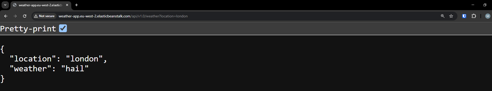
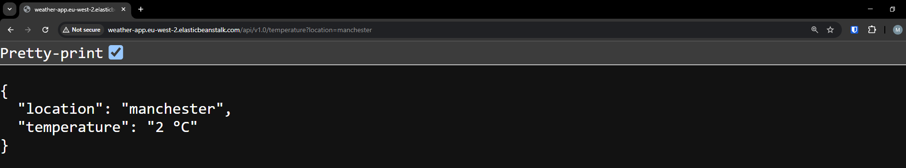

# Weather API

  
A simple web API built with Python and Flask that provides weather-related information. This service is designed to allow other web applications to connect and retrieve random weather data for a given location.

---

## Table of Contents
1. [About the Project](#about-the-project)
2. [Endpoints](#endpoints)
3. [Getting Started](#getting-started)
4. [Deploying to AWS Elastic Beanstalk](#deploying-to-aws-elastic-beanstalk)
    - [Step-by-Step Guide](#step-by-step-guide)
5. [Reference](#reference)
6. [License](#license)

---

## About the Project
This Flask-based web API provides three endpoints for weather-related information:
- `weather`
- `temperature`
- `wind speed and direction`

The API is designed to simulate weather data for a given location.

---

## Endpoints

### 1. Weather
- **Endpoint:** `/weather`
- **Method:** `GET`
- **Query Parameters:**
  - `location` (required): The location for which weather data is requested.
- **Response:** A random weather description (e.g., sunny, cloudy, rainy).

### 2. Temperature
- **Endpoint:** `/temperature`
- **Method:** `GET`
- **Query Parameters:**
  - `location` (required): The location for which temperature data is requested.
- **Response:** A random temperature in Celsius.

### 3. Wind Speed and Direction
- **Endpoint:** `/wind`
- **Method:** `GET`
- **Query Parameters:**
  - `location` (required): The location for which wind speed and direction data is requested.
- **Response:** A random wind speed (e.g., 15 kts) and direction (e.g., 45 deg).

---

## Select your OS to get started

<details>
<summary>Windows</summary>

### Prerequisites
- Python and pip installed.
- Git installed.

1. Clone the repository:
   ```cmd
   git clone https://github.com/madang804/weather-api.git
   ```
2. Navigate to the project directory:
   ```cmd
   cd weather-api
   ```
3. Create a virtual environment:
   ```cmd
   python -m venv venv
   ```
4. Activate the virtual environment:
   ```cmd
   venv\Scripts\activate
   ```
5. Install dependencies:
   ```cmd
   pip install -r requirements.txt
   ```
6. Run the Flask app:
   ```cmd
   flask --app application run
   ```
7. Open a browser and visit `http://127.0.0.1:5000` to test the API locally.
8. Deactivate the virtual environment:
   ```cmd
   deactivate
   ```
</details>

<details>
<summary>MacOS</summary>

### Prerequisites
- Python and pip installed.
- Git installed.

1. Clone the repository:
   ```bash
   git clone https://github.com/madang804/weather-api.git
   ```
2. Navigate to the project directory:
   ```bash
   cd weather-api
   ```
3. Create a virtual environment:
   ```bash
   python3 -m venv venv
   ```
4. Activate the virtual environment:
   ```bash
   source venv/bin/activate
   ```
5. Install dependencies:
   ```bash
   pip install -r requirements.txt
   ```
6. Run the Flask app:
   ```bash
   flask --app application run
   ```
7. Open a browser and visit `http://127.0.0.1:5000` to test the API locally.
8. Deactivate the virtual environment:
   ```bash
   deactivate
   ```
</details>

<details>
<summary>Linux</summary>

### Prerequisites
- Python and pip installed.
- Git installed.

1. Clone the repository:
   ```bash
   git clone https://github.com/madang804/weather-api.git
   ```
2. Navigate to the project directory:
   ```bash
   cd weather-api
   ```
3. Create a virtual environment:
   ```bash
   python3 -m venv venv
   ```
4. Activate the virtual environment:
   ```bash
   source venv/bin/activate
   ```
5. Install dependencies:
   ```bash
   pip install -r requirements.txt
   ```
6. Run the Flask app:
   ```bash
   flask --app application run
   ```
7. Open a browser and visit `http://127.0.0.1:5000` to test the API locally.
8. Deactivate the virtual environment:
   ```bash
   deactivate
   ```
</details>

## Deploying to AWS Elastic Beanstalk

The Flask app is deployed to AWS Elastic Beanstalk via the AWS Console. Below is a step-by-step guide.

### Step-by-Step Guide

#### 1. Zip Application Files
- Create a `.zip` file that include `application.py` and `requirements.txt`.

<details>
<summary>Windows</summary>

### Prerequisites
- 7-Zip installed.

  ```cmd
  "C:\Program Files\7-Zip\7z.exe" a -tzip application.zip application.py requirements.txt
  ```
</details>

<details>
<summary>MacOS</summary>

### Prerequisites
- Zip installed.

  ```bash
  "zip application.zip application.py requirements.txt
  ```
</details>

<details>
<summary>Linux</summary>

### Prerequisites
- Zip installed.

  ```bash
  "zip application.zip application.py requirements.txt
  ```
</details>

#### 2. Log In to AWS Management Console
1. Navigate to the [AWS Elastic Beanstalk Console](https://console.aws.amazon.com/elasticbeanstalk).
2. Click **Create Application**.

#### 3. Create a New Elastic Beanstalk Application
1. Under **Application information** enter a name for application (e.g., `WeatherAPI`).
2. Under **Environment information**:
   - **Domain:** Prefix name (e.g., `weather-api`).
   - Click **Check availability**.
   - If the prefix name is not available, try another name.
   - Leave it blank for autogenerated prefix name.
3. Under **Platform**:
   - **Platform:** Python
   - **Platform Branch:** Python 3.x (the version matching the app).

#### 4. Upload Flask Application
1. Under **Application code**:
   - **Upload your code**
   - **Version label:** v1.0
   - **Local file:** Upload `.zip` file (created in step `Zip Application Files`).
2. Click **Next**.
3. Under **Service access**:
   - **EC2 instance profile:** select EC2 instance profile from dropdown list.
   - If no EC2 instance profiles are listed, create a new IAM role that contains the following permissions policies:
     - AWSElasticBeanstalkWebTier
     - AWSElasticBeanstalkWorkerTier
     - AWSElasticBeanstalkMulticontainerDocker
   - After creating the IAM Role, select the IAM role you just created. If the IAM role do not appear, click `Refresh` button.
4. Click **Skip to Review** to accept all remaining default settings. If not, click **Next** to apply further settings.
5. Click **Submit** after review on the final page.

#### 5. Monitor Deployment
- Wait for the environment creation process to complete.
- Once the screen displays **Environment successfully launched**, the application is live.

  

#### 6. Test API
1. Copy the URL of the deployed application (e.g., `http://weather-api.eu-west-2.elasticbeanstalk.com`).

   

2. Test the endpoints using browser.

   

   

   

3. Test the endpoints using curl (optional).

   

   

   

---

## Reference

- https://docs.aws.amazon.com/elasticbeanstalk/latest/dg/Welcome.html
- https://flask.palletsprojects.com
- https://www.python.org

---

## License
This project is licensed under the MIT License. See [LICENSE](./LICENSE) for more details.

---


