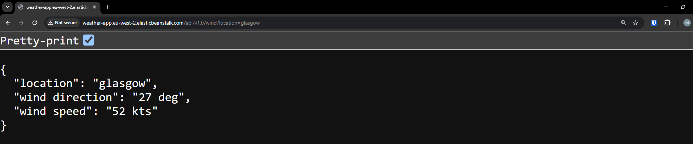
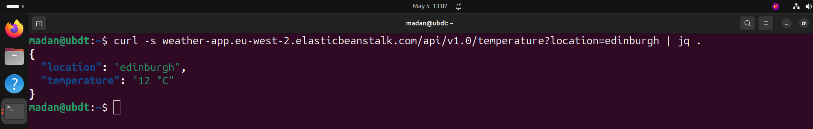

# Weather API

  
A simple web API built with Python and Flask that provides weather-related information. This service is designed to allow other web applications to connect and retrieve random weather data for a given location.

---

## Table of Contents
1. [About the Project](#about-the-project)
2. [Endpoints](#endpoints)
3. [Getting Started](#getting-started)
    - [Prerequisites](#prerequisites)
    - [Installation](#installation)
4. [Deploying to AWS Elastic Beanstalk](#deploying-to-aws-elastic-beanstalk)
    - [Step-by-Step Guide](#step-by-step-guide)
5. [Reference](#reference)
6. [License](#license)

---

## About the Project
This Flask-based web API provides three endpoints for weather-related information:
- `weather at location`
- `temperature at location`
- `wind speed at location`

The API is designed to simulate weather data for a given location.

---

## Endpoints

### 1. Weather at Location
- **Endpoint:** `/weather`
- **Method:** `GET`
- **Query Parameters:**
  - `location` (required): The location for which weather data is requested.
- **Response:** A random weather description (e.g., sunny, cloudy, rainy).

### 2. Temperature at Location
- **Endpoint:** `/temperature`
- **Method:** `GET`
- **Query Parameters:**
  - `location` (required): The location for which temperature data is requested.
- **Response:** A random temperature in Celsius.

### 3. Wind Speed at Location
- **Endpoint:** `/wind`
- **Method:** `GET`
- **Query Parameters:**
  - `location` (required): The location for which wind speed and direction data is requested.
- **Response:** A random wind speed (e.g., 15 kts) and direction (e.g., 45 deg).

---

## Getting Started

### Prerequisites
- Python installed on your local machine.
- Flask installed via pip:
  ```bash
  pip install flask
  ```

### Installation
1. Clone the repository:
   ```bash
   git clone https://github.com/madang804/weather-api.git
   ```
2. Navigate to the project directory:
   ```bash
   cd weather-api
   ```
3. Run the Flask app:
   ```bash
   flask --app application run   
   ```
4. Open your browser and visit `http://127.0.0.1:5000` to test the API locally.

---

## Deploying to AWS Elastic Beanstalk

This project is deployed to AWS Elastic Beanstalk via the AWS Console. Below is a step-by-step guide.

### Step-by-Step Guide

#### 1. Prepare Your Flask Application
1. Ensure your Flask app has the following structure:
   ```
   ├── application.py    # Main Flask app
   └── requirements.txt  # Dependencies
   ```

2. Create a `requirements.txt` file if it doesn’t exist:
   ```bash
   pip freeze > requirements.txt
   ```

#### 2. Zip Your Application Files
- Create a `.zip` file of your application folder. Include `application.py`, `requirements.txt`.
  ```bash
  zip application.zip application.py requirements.txt
  ```

#### 3. Log In to AWS Management Console
1. Navigate to the [AWS Elastic Beanstalk Console](https://console.aws.amazon.com/elasticbeanstalk).
2. Click **Create Application**.

#### 4. Create a New Elastic Beanstalk Application
1. Under **Application information** enter a name for your application (e.g., `WeatherAPI`).
2. Under **Environment information**, select:
   - **Domain:** Your domain name (e.g., `weather-api`).
   - Click **Check availability**.
   - If your chosen domain name is not available, try another name.
   - Leave it blank for autogenerated domain name.
3. Under **Platform**, select:
   - **Platform:** Python
   - **Platform Branch:** Python 3.x (the version matching your app).

#### 5. Upload Your Flask Application
1. Under **Application code**, select:
   - **Upload your code**
   - **Version label:** v1.0
   - **Local file:** Upload `.zip` file (created in step `Zip Your Application Files`).
2. Click **Next**.
3. Under **Service access**, select:
   - **EC2 instance profile:** ElasticBeanstalk-EC2Role
   - If the ElasticBeanstalk-EC2Role does not exist in the dropdown list, create IAM Role for EC2 instance profile.
   - After creating the IAM Role for EC2 instance profile, select the IAM Role you just created from the EC2 instance profile dropdown list.
4. Click **Skip to Review**.
5. Click **Submit**.

#### 6. Monitor Deployment
- Wait for the environment creation process to complete.
- Once the screen displays **Environment successfully launched**, your application is live.


#### 7. Test Your API
1. Copy the URL of your deployed application (e.g., `http://weather-api.eu-west-2.elasticbeanstalk.com`).
   - 
2. Test the endpoints using a browser.
   - 
   - 
   - 
3. Test the endpoint using curl (optional)
   - 
   - 
   - 

---

## Reference

- https://docs.aws.amazon.com/elasticbeanstalk/latest/dg/Welcome.html
- https://flask.palletsprojects.com
- https://www.python.org

---

## License
This project is licensed under the MIT License. See [LICENSE](./LICENSE) for more details.

---


